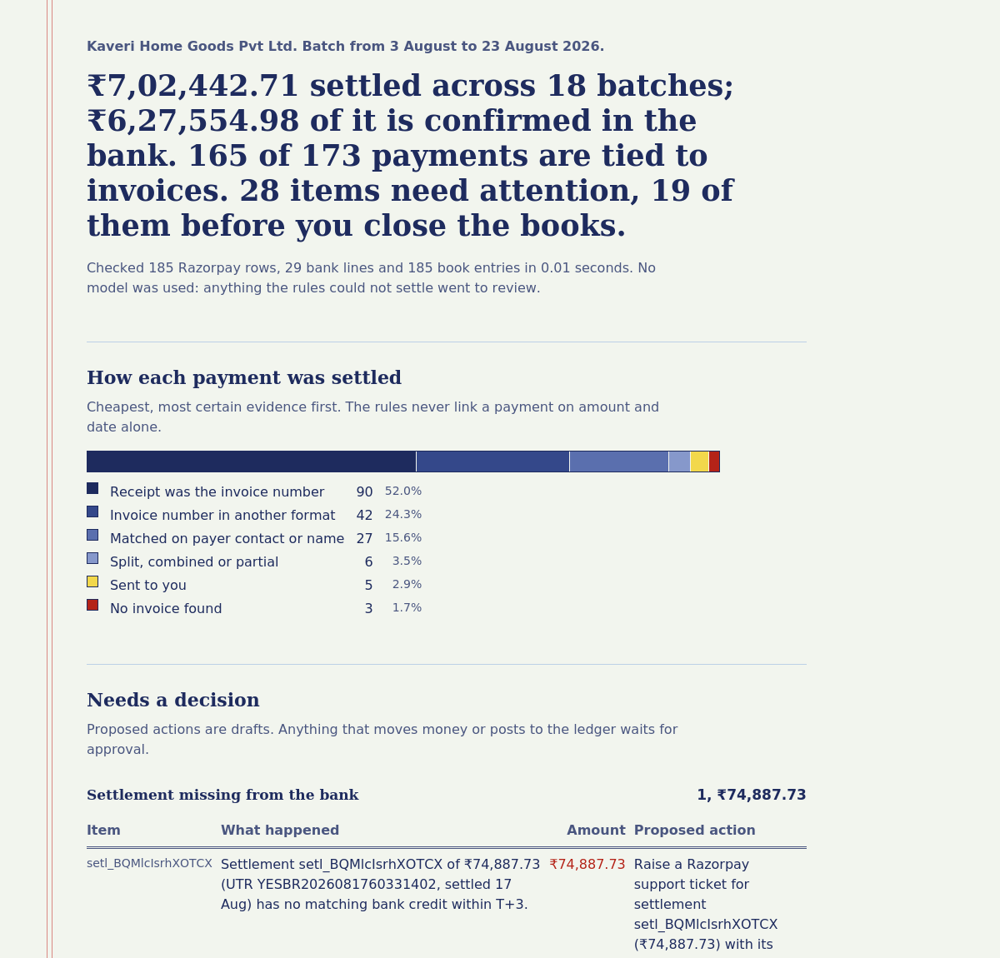
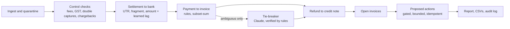

# ReconLoop

Three-way settlement reconciliation for Razorpay merchants, graded against an answer key.

Every day a D2C merchant on Razorpay has to answer four questions: did each settlement actually reach the bank, is every captured payment tied to an invoice, does every refund have a credit note, and were fees and GST charged at the contracted rate. ReconLoop answers them for a batch, proposes the follow-up actions, and sends anything it cannot settle to a person with a plain reason.

Deterministic rules do almost all of the work. A model is only asked to break ties the rules cannot, it can only choose from what it was shown, and the rules re-check every answer before anything is linked.

**[Try it live](https://huggingface.co/spaces/dn2066/reconloop)**: pick a batch, pick a tie-breaker, and watch it get scored against the answer key. The whole engine runs in your browser (Python via Pyodide), so nothing you upload leaves your machine. Or run it yourself: `python -m reconloop demo`.



Open [`docs/sample-report.html`](docs/sample-report.html) for the full report on the sample batch.

## Results on held-out batches

20 batches (10 standard, 10 hard; about 8,400 records in total), generated from seeds that were never looked at while building. Full tables, including a per-scenario breakdown, are in [`bench/results.md`](bench/results.md).

| Batch | Tie-breaker | Wrong links (10 batches) | Payment to invoice P / R | Exceptions P / R | Sent to review per batch | Error cost per 100 records |
|---|---|---|---|---|---|---|
| standard | rules only | **0** | 100.0% / 97.9% | 100.0% / 80.6% | 5.2 | 5.43 |
| standard | greedy baseline | 33 | 98.1% / 99.0% | 91.5% / 87.0% | 0 | 7.48 |
| standard | oracle ceiling | 0 | 100.0% / 100.0% | 100.0% / 100.0% | 0.6 | 0.15 |
| hard | rules only | **0** | 100.0% / 96.8% | 100.0% / 79.8% | 8.8 | 8.39 |
| hard | greedy baseline | 57 | 96.9% / 98.5% | 91.4% / 85.4% | 0 | 11.96 |
| hard | oracle ceiling | 0 | 100.0% / 100.0% | 100.0% / 100.0% | 1.0 | 0.23 |

Settlement to bank and refund to credit note were 100% / 100% in every row.

How to read this:

- **Rules only** never linked money wrongly. What it could not prove went to review, which is where its recall and exception misses come from.
- **Greedy baseline** always takes the top-scoring candidate and never abstains. It clears the queue and pays for it with 90 wrong links. That is the failure mode a careless model tie-breaker would reproduce.
- **Oracle ceiling** reads the answer key. It is not a result; it shows how much review work a perfect tie-breaker could remove, which is the headroom for Claude.
- **Claude as tie-breaker** is wired in and tested against a mocked API. Run `make bench-claude` with an API key to add its row; see [Run it](#run-it).

On hard batches the rules got every scenario right except the two that need someone to read the payer's note: 58 of 58 "nickname or on behalf of" payments and 20 of 20 "stranger paying the same amount as an open invoice" went to review, with zero wrong links. All 10 deliberately undecidable cases went to a person.

Error cost prices mistakes the way finance feels them: 5 per wrong link (money marked reconciled when it is not), 3 per missed exception, 1 per false exception, 1 per item a person has to review.

## What is in a batch

A batch folder holds three inputs and, for synthetic batches, the answer key.

| File | Source | Notes |
|---|---|---|
| `razorpay_recon.csv` | Razorpay settlement recon report | Mirrors `GET /v1/settlements/recon/combined`: paise, `fee` includes GST, `tax` is the GST part, `settlement_utr`, `order_receipt`, `dispute_id`. `email`/`contact` would come from the Payments API. |
| `bank_statement.csv` | Current account statement | Rupees with Indian grouping, `DD-MM-YYYY` dates, free-text narrations. |
| `books.csv` | Invoices and credit notes | What the merchant's accounting system says. |
| `ground_truth.json` | Generator | True links, planted exceptions, cases a person should decide, interchangeable invoices. |

The generator (`reconloop generate`) builds three weeks for a fictional merchant with problems planted on purpose:

| Planted problem | Why it is hard |
|---|---|
| Receipt in another format (`inv_00123`, `00123`) or only in the note (`pymt agnst invc no. 187`) | Exact matching misses it; loose matching invents references ("Order for 2 bedsheets" is not invoice 2). |
| No reference, only the payer's contact | Needs identity evidence plus amount and date. |
| One invoice paid in two parts; one payment for two invoices | Needs subset-sum, bounded to one customer. |
| Same customer, same amount, same day, twice | The two invoices are interchangeable; the grader treats them as one answer. |
| Double capture on one order | Keep the first, flag the second, propose a refund. |
| Payer note that must be read: "Paid by Arjun for his mother's order (Mrs. Lakshmi)" with an open invoice for an Arjun Mehta | String similarity scores both candidates the same. |
| Near-miss names: Sneha K. vs Snehal Kapoor, Mohd Irfan vs Irfana Begum | Fuzzy matching over-matches. |
| "Rahul D." with open invoices for Rahul Deshpande and Rahul Desai | Nobody can know. Linking it counts as a wrong link even when the guess is right. |
| A stranger pays exactly the amount of someone else's open invoice | Amount and date alone must never link. |
| Fee above contract, GST miscalculated | Checked against a (synthetic) rate card. |
| Refund with no credit note, chargeback debit | Chained through the payment's invoice. |
| Bank credits short by a bank charge, a settlement that never arrives, a Razorpay-looking credit with no settlement | Classic settlement breaks. |
| Two settlements with identical amounts on consecutive days, no UTR in the narration | Resolved with the bank lag learned from confident matches. |
| UTR truncated at the front (shared by every settlement that month) or at the back | Only a fragment unique to one settlement counts on its own. |
| An unrelated IMPS credit for exactly a missing settlement's amount | Only Razorpay credits are candidates. |
| A bank row with a letter O where a zero should be | Quarantined and reported, never silently dropped. |

## How it works



Payment to invoice runs in passes, most certain first:

1. Receipt equals the invoice number.
2. Invoice serial read from the receipt or the note; a note listing several invoices links only if they add up exactly.
3. Evidence score from contact, name, amount and date. Links only with identity evidence, a score of at least 0.80, a 0.15 margin over the runner-up, and no other payment holding an equal claim.
4. Split and combined payments by subset-sum over one customer's items.
5. Step 3 again, since step 4 can free contested invoices.
6. A reference with an out-of-band amount becomes a partial payment or a review.
7. Tie-breaker for what is left, if anything connects the payment to a candidate.
8. Nothing fits at all: missing invoice.

Every threshold is in [`reconloop/config.py`](reconloop/config.py); [`docs/DESIGN.md`](docs/DESIGN.md) walks through the scoring with worked examples.

## Where a model is used, and where it is not

| Step | Model? | Why |
|---|---|---|
| Settlement to bank | No | Amounts, dates and UTRs. Arithmetic does not need judgment. |
| Fee, GST, double captures, chargebacks | No | Contract math and grouping. |
| Payment to invoice, clear cases (about 96% of payments) | No | References, contacts and names settle them. |
| Payment to invoice, ambiguous cases (3 to 5%) | Claude | Reading "Kiran from Brightpath, office order" is language, not arithmetic. |
| Refund to credit note | No | Follows the payment's invoice. |

What the tie-breaker gets and can do:

- **Sees:** amounts, dates, customer names, the payer's note, and evidence the rules computed (contact match yes/no, name similarity, days apart). A real case is in [`docs/example_tie_breaker_case.json`](docs/example_tie_breaker_case.json).
- **Never sees:** email addresses or phone numbers. Contact matching happens locally.
- **Can answer:** one of the offered invoice ids, `NONE`, or `UNSURE`, through a forced tool call with an enum.
- **Gets overruled when:** it names an id it was not offered, its confidence is below 0.75, it says `NONE` while contact or reference evidence points at a candidate, the invoice was already taken, or the call fails or returns no tool call. All of these become reviews with the reason recorded.
- **Is cached:** decisions are keyed by a hash of prompt version, model and case, so reruns are reproducible and free.

The system prompt names no benchmark cases. The nickname and on-behalf traps are not in the prompt, so a good Claude score has to come from reading the note.

## Guardrails

- A payment is never linked on amount and date alone.
- Proposed actions are drafts. Anything that moves money or posts to the ledger has `requires_approval`, a `max_amount_paise` ceiling and a stable idempotency key. Nothing executes.
- Unreadable rows are set aside and reported as exceptions.
- `audit.jsonl` records every link, exception and tie-breaker call, including the model's stated reason and the verdict on it.
- CI fails if the rules make a single wrong link on the held-out batches.

## Run it

Python 3.10+. The core has no third-party dependencies.

```bash
python -m reconloop demo                    # sample batch -> out/demo/report.html
pip install -e ".[dev]" && pytest -q        # 83 tests
make bench                                  # held-out benchmark -> bench/results.md
```

The web demo (same engine, in a browser):

```bash
pip install -e ".[app]"
python app.py                               # http://127.0.0.1:7860
```

With Claude as tie-breaker:

```bash
pip install -e ".[claude]"
export ANTHROPIC_API_KEY=...
export RECONLOOP_MODEL=claude-sonnet-5      # optional; this is the default
python -m reconloop run --data data/sample --out out/claude --tie-breaker claude
make bench-claude                           # -> bench-claude/results.md
```

On real data, put the three CSVs in a folder with the same columns and run `reconloop run --data <folder>`. There is no accuracy score without an answer key, but the report, exceptions, review queue and actions are the same. `reconloop fetch-razorpay` pulls the recon report through the API; it is covered by a unit test with a fake HTTP client and has not been run against a live account.

Each run writes `links.csv`, `exceptions.csv`, `review_queue.csv`, `actions.json`, `audit.jsonl`, `tie_breaker_log.json`, `summary.json`, `score.json` (when an answer key exists) and `report.html`.

## What broke along the way

The full log is in [`docs/BUILD_LOG.md`](docs/BUILD_LOG.md). The ones worth knowing:

- The note parser once read "Order for 2 bedsheets" as invoice 2.
- The generator created every true invoice before its decoy, so "pick the lower invoice number" would have won every name trap. Order is now shuffled and a test guards it.
- The first held-out run crashed: on one hard batch, a ₹4,149 refund landed on a day with only three small payments, so that settlement came out negative. Debits now carry into the next settlement.
- The same run showed a planted "discount" of ₹150 on ₹1,299, which is 10.35% and outside the 10% band the rules use. The agent had called it a partial payment, which is what its rules say. The generator was fixed, and the reported numbers moved to fresh seeds. No matching rule changed after that first held-out run.

## Deploying the demo

Two versions, same engine. `site/index.html` runs everything in the visitor's browser and deploys free as a
static page (`python scripts/build_static.py` rebuilds it). `app.py` is the server version with the optional
Claude tie-breaker; this README's front matter configures it as a Hugging Face Space. [`docs/DEPLOY.md`](docs/DEPLOY.md)
has the steps for both, including the model budget that keeps a public demo from running up an API bill.

## Limits

- All numbers come from synthetic data. The rate card is synthetic too.
- The trap list lives in this repo, so someone could tune against it. A hidden trap set would make the benchmark harder to game.
- Claude's accuracy is not reported here until `make bench-claude` has been run with a key.
- The recon report connector is untested against a live Razorpay account. Settlement totals are recomputed from rows rather than checked against the Settlements API.
- Single currency (INR). No GSTR-2B reconciliation of Razorpay's GST invoices.
- The report is a static HTML page. Actions are proposals by design; executing them is left to the approver's own tools.

## Layout

```
reconloop/
  generate.py          synthetic batches with an answer key
  checks.py            fee, GST, double capture, chargeback checks
  match_settlements.py settlement to bank
  match_books.py       payment to invoice, refund to credit note
  resolver.py          offline, greedy, oracle and Claude tie-breakers
  agent.py             the loop, end to end
  actions.py           gated action proposals
  score.py, bench.py   grading and the benchmark
  report.py            HTML report
  connectors/          Razorpay recon report fetcher
app.py                 the web demo (Hugging Face Space entry point)
scripts/deploy_space.py  one-command deploy
static/, site/          the browser version: template and built page
tests/                 83 tests, including a lying tie-breaker, a failing API and a spent model budget
data/sample/           the demo batch (seed 7)
bench/                 held-out results
docs/                  design notes, build log, sample report
```

## How this was built

Designed and built by Dinesh Natarajan with Claude as a pair programmer. The benchmark, the grader and the failure analysis are the point: every number above can be reproduced with the commands in this file.

MIT licensed.
